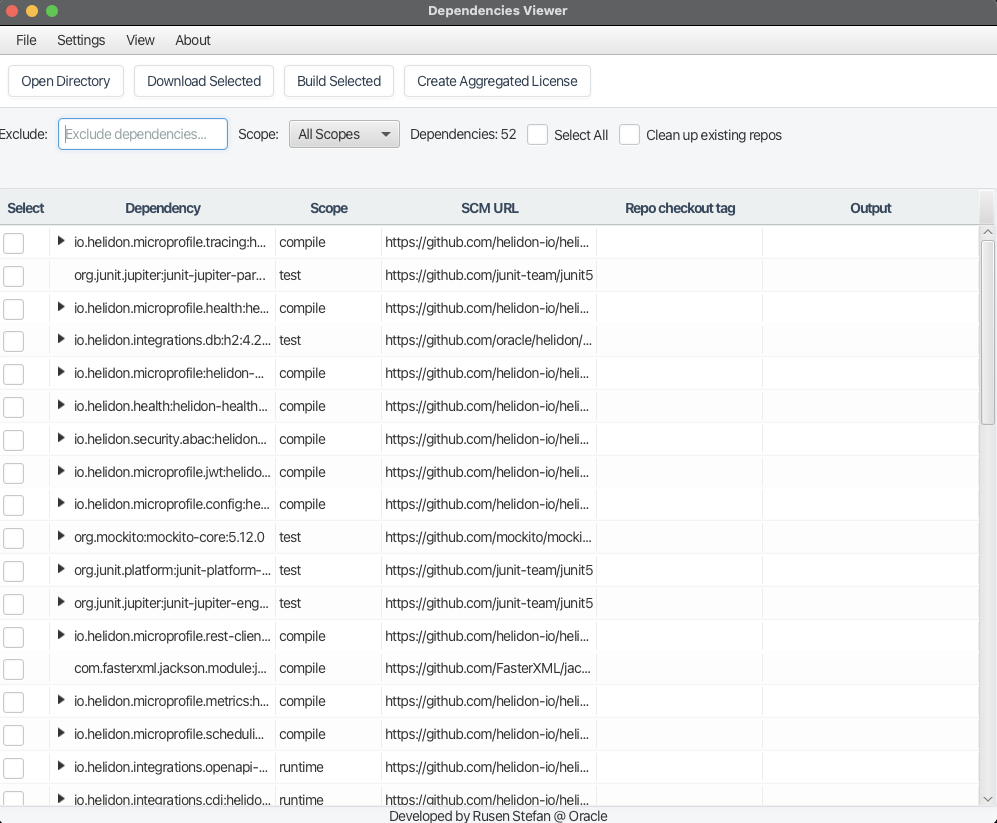

# Maven Dependency Searcher & Builder

A powerful tool for analyzing Maven project dependencies, resolving source code repositories, and rebuilding dependencies from source. This application is designed to help developers inspect dependency trees, fetch source code (Git), and compile projects using specific JDK versions via Maven Toolchains.



## Features

-   **Dependency Tree Visualization**: Graphically inspect the full dependency tree of any Maven project.
-   **Source Resolution**: Automatically resolves Git/SCM URLs for dependencies found in the tree.
-   **Selective Build**: Filter, select, and download source code for specific dependencies.
-   **Cross-Version Building**: Automatically builds dependencies using the correct JDK version (Java 8, 11, 17, 21) via Maven Toolchains.
-   **Smart Build System**: Prioritizes `toolchains.xml` but includes fallback logic for tricky projects.
-   **Task Management**: Visual feedback with progress bars and preventing conflicting operations.
-   **Cross-Platform**: Runs on Windows, macOS, and Linux as a single executable JAR.

---

## 🚀 Getting Started

### Prerequisites

1.  **Java 21+**: You need JDK 21 or higher installed to run the application itself.
    *   *Note: You do NOT need a special JavaFX-bundled JDK anymore; the application includes necessary libraries.*
2.  **Maven**: A local installation of Apache Maven (3.9.x recommended).
3.  **Target JDKs**: If you plan to build older dependencies, ensure you have the relevant JDKs installed (e.g., JDK 8, JDK 11, JDK 17).

### 🛠️ Installation

1.  **Clone the Repository**:
    ```bash
    git clone <repository-url>
    cd maven-dep-searcher
    ```

2.  **Build the Application**:
    Run the following Maven command to create the executable JAR:
    ```bash
    mvn clean package
    ```

3.  **Locate the JAR**:
    The executable file will be generated in the `target` directory:
    *   `target/maven-dep-searcher-1.0-SNAPSHOT.jar`

---

## 🏃 Running the Application

This application is packaged as a cross-platform executable JAR.

### Windows, macOS, and Linux
Open your terminal or command prompt and run:

```bash
java -jar target/maven-dep-searcher-1.0-SNAPSHOT.jar
```

*Note: On Windows, you might also be able to double-click the JAR file if your `.jar` association is set to Java 21.*

---

## ⚙️ First-Time Configuration

Upon first launch, you must configure your environment for the tool to work correctly.

1.  **Open Settings**:
    *   Go to the menu bar: `Settings` -> `Environment Settings`.

2.  **Configure JDK Paths**:
    *   The application needs to know where your various JDKs are installed to build dependencies correctly.
    *   Use the **Browse** buttons to select the home directories for:
        *   **JAVA8_HOME** (e.g., `/Library/Java/JavaVirtualMachines/jdk1.8.0_xxx.jdk/Contents/Home` or `C:\Program Files\Java\jdk1.8.0_xxx`)
        *   **JAVA11_HOME**
        *   **JAVA17_HOME**
        *   **JAVA21_HOME**
    *   Click **Save**. These settings are stored in `env-settings.properties` in the application's working directory.

3.  **Verify Environment Variables**:
    *   Ensure your system has `MAVEN_HOME` set to your Maven installation directory.
    *   Ensure `JAVA_HOME` is set (usually to your main JDK 21+).
    *   *The application will warn you if these are missing when you try to open a project.*

---

## 📖 Usage Guide

1.  **Open a Project**:
    *   Click **Open Directory** and select the root directory of the Maven project you want to analyze (must contain a `pom.xml`).
    *   The tool will parse the project and display the dependency tree.

2.  **Filter & Select**:
    *   Use the **Filter** text box to search for specific artifacts (e.g., `commons-lang`).
    *   Check the boxes next to the dependencies you want to work with.

3.  **Download Source**:
    *   Click **Download Selected**. The tool will attempt to clone the SCM repositories for the selected dependencies into a `downloaded_repos` folder.

4.  **Build**:
    *   Click **Build Selected**.
    *   The tool will inspect each project, detect its extensive Java version requirements, generate a `toolchains.xml`, and trigger a Maven build using the correct JDK.
    *   **Result**: You will see a summary of successful and failed builds. Source code is built in `downloaded_repos/<project>`.

---

## 🔧 Troubleshooting & Notes

*   **"Command not found"**: Ensure `java` and `mvn` are in your system PATH.
*   **MacOS M1/M2 Users**: If you encounter `OutOfMemory` or strange failures with older dependencies (e.g., `hibernate-validator`), it might be due to architecture mismatches in plugins like Jruby. Running with an x86_64 JDK (via Rosetta) often resolves this.
*   **Gradle Projects**: The tool has limited support for building Gradle-based dependencies found in the tree, attempting to use the wrapper (`gradlew`) found in the repo.
*   **paths**: All downloaded repositories and settings are stored relative to the JAR file location (or project root if running from IDE), ensuring portability.
