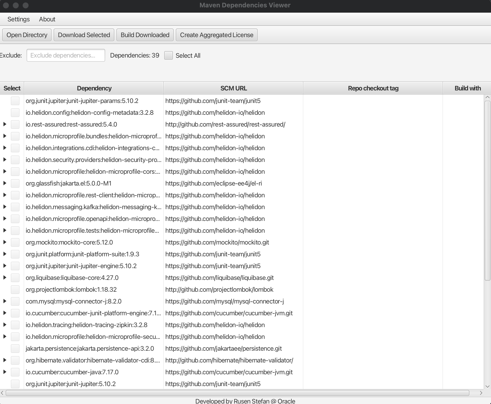

# Maven Dependency Analyzer

## Overview

This application analyzes the dependency tree of a Maven project and attempts to resolve the source code URLs for each dependency.
Users can filter and select dependencies to download their source code and build them from the source.

## Features

- Analyzes Maven project dependency trees.
- Resolves source code URLs for dependencies.
- Allows filtering and selection of dependencies.
- Builds dependencies from downloaded source code.

## JDK Configuration

1. **SDKMAN**
    - To easily manage multiple jdks, you can use SDKMAN: https://medium.com/@gayanper/sdkman-on-windows-661976238042

## Usage

1. **Environment Setup**
    - Ensure `JAVA_HOME` is configured to point to JDK version 21 or higher.
    - Configure `MAVEN_HOME` to point to your local Maven installation.
    - In order for the project to run using the jar generated, the easist way of running it is using a jdk that comes up with
      the javafx sdk. The Zulu 21 JFX JDK comes prebundled with
      javafx: https://www.azul.com/downloads/?version=java-21-lts&architecture=x86-64-bit&package=jdk-fx&show-old-builds=true#zulu

2. **Configuration**
    - Set `JAVA8_HOME` , `JAVA11_HOME` and `JAVA17_HOME` environment variables to specify specific Java versions required for some
      repositories.

3. **Building and Running**
    - Use the application to analyze and resolve Maven project dependencies.
    - Download and build selected dependencies from their source code.

4. **Artifact Management**
    - Since build artifacts may lack a predefined target location and projects could use Gradle or Maven, manual uploading to an
      internal repository is necessary.

## Configuration

- Ensure `JAVA_HOME` points to JDK version 21 or higher.
- Configure `MAVEN_HOME` to specify the local Maven 3.9.x installation directory.

## Environment Settings

- **JAVA8_HOME:** Path to JDK 8 installation.
- **JAVA11_HOME:** Path to JDK 11 installation.
- **JAVA17_HOME:** Path to JDK 17 installation.

## Requirements

- **JAVA_HOME:** Configured to JDK version 21 or higher.
- **MAVEN_HOME:** Configured to a local Maven installation.

## How to run:

- After the build is finished run using `java -jar maven-dep-searcher.jar` command

---

## Encountered Issues

- On MACOS M1, while building some dependencies like hibernate-validator, an OutOfMemory exception was encountered due to a
  asciidoc plugin running Jruby. The solution was to use a java executable on x86_64 architecture instead of ARM64 architecture. The
  issue is caused by a memory leak in the Jruby library.
